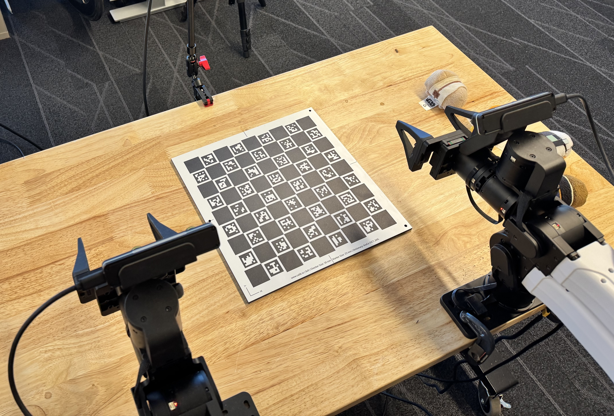

# Camera calibration

## Overview

Raiden uses ChArUco boards to calibrate cameras. Two types of calibration are
supported:

- **Hand-eye calibration** (wrist cameras) - determines the rigid transform
  from the camera frame to the gripper frame (`T_camera→gripper`).
- **Scene camera calibration** - determines the transform from the camera
  frame to the robot base frame (`T_camera→base`).



## Step 1 - Print a ChArUco board

Print a ChArUco board and mount it rigidly (e.g. on a flat aluminium plate).
For best results, consider an industry-grade printed target from
[calib.io](https://calib.io/products/charuco-targets). These are manufactured
on dimensionally stable material and give lower reprojection errors than
paper prints.

## Step 2 - Record calibration poses

Move the robot to a series of diverse poses while the board is visible. At
least **5 poses** are required; 7–10 is recommended for good coverage.

```bash
rd record_calibration_poses
```

A live Rerun viewer opens automatically in your browser so you can verify that
the board is visible from all cameras before recording each pose. The URL and
an SSH tunnel command are printed to the terminal:

```
Rerun viewer:    http://localhost:9877?url=...
SSH tunnel:      ssh -L 9877:localhost:9877 -L 9878:localhost:9878 <host>
```

Images are refreshed at **1 Hz**. The right wrist camera image is
automatically rotated 180° to correct for its upside-down mounting.

Keyboard controls:

- **R** - record current pose
- **D** - delete last recorded pose
- **L** - list all recorded poses
- **Q** - quit (saves if enough poses recorded)

Poses are saved to `~/.config/raiden/calibration_poses.json`.

## Step 3 - Run calibration

```bash
rd calibrate
```

If your board has different dimensions or a different dictionary, pass them here:

```bash
rd calibrate \
    --squares-x 9 \
    --squares-y 9 \
    --square-length 0.03 \
    --marker-length 0.023 \
    --dictionary DICT_6X6_250
```

| Parameter | Default | Description |
|---|---|---|
| `--squares-x` | `9` | Number of squares along X |
| `--squares-y` | `9` | Number of squares along Y |
| `--square-length` | `0.03` | Checker square side length in metres |
| `--marker-length` | `0.023` | ArUco marker side length in metres |
| `--dictionary` | `DICT_6X6_250` | ArUco dictionary |

Raiden reads `~/.config/raiden/camera.json` and calibrates every camera whose
`role` is `"left_wrist"`, `"right_wrist"`, or `"scene"` automatically - no
explicit camera IDs are required.

The runner will:

1. Load the recorded poses from `~/.config/raiden/calibration_poses.json`
2. Move the robot to each pose
3. Capture frames from all target cameras
4. Detect the ChArUco board in each frame
5. Run hand-eye / scene calibration
6. Save results to `~/.config/raiden/calibration_results.json`

## Output

`~/.config/raiden/calibration_results.json` contains one entry per camera:

```json
{
  "version": "1.0",
  "timestamp": "2026-03-12T22:00:00.000000",
  "coordinate_frame": "left_arm_base",
  "cameras": {
    "left_wrist_camera": {
      "type": "hand_eye",
      "serial_number": 16522755,
      "intrinsics": {
        "camera_matrix": [[526.7, 0, 319.4], [0, 526.7, 178.5], [0, 0, 1]],
        "distortion_coeffs": [-0.041, 0.013, 0.0, 0.0, 0.0],
        "image_size": [672, 376],
        "source": "zed_sdk_factory_calibration"
      },
      "num_poses_used": 8,
      "hand_eye_calibration": {
        "success": true,
        "rotation_matrix": [[0.999, -0.012, 0.008], [0.012, 0.999, -0.003], [-0.008, 0.003, 0.999]],
        "translation_vector": [0.012, -0.034, 0.061],
        "rotation_vector": [-0.003, 0.008, 0.012],
        "method": "Tsai"
      }
    },
    "scene_camera": {
      "type": "scene",
      "serial_number": 37038161,
      "intrinsics": {
        "camera_matrix": [[700.1, 0, 659.8], [0, 700.1, 371.2], [0, 0, 1]],
        "distortion_coeffs": [-0.052, 0.021, 0.0, 0.0, 0.0],
        "image_size": [1280, 720],
        "source": "zed_sdk_factory_calibration"
      },
      "num_poses_used": 8
    }
  },
  "bimanual_transform": {
    "right_base_to_left_base": [[1, 0, 0, -0.612], [0, 1, 0, 0.0], [0, 0, 1, 0.0], [0, 0, 0, 1]],
    "computed_from_calibration": true,
    "description": "Transform from right arm base frame to left arm base frame"
  }
}
```

